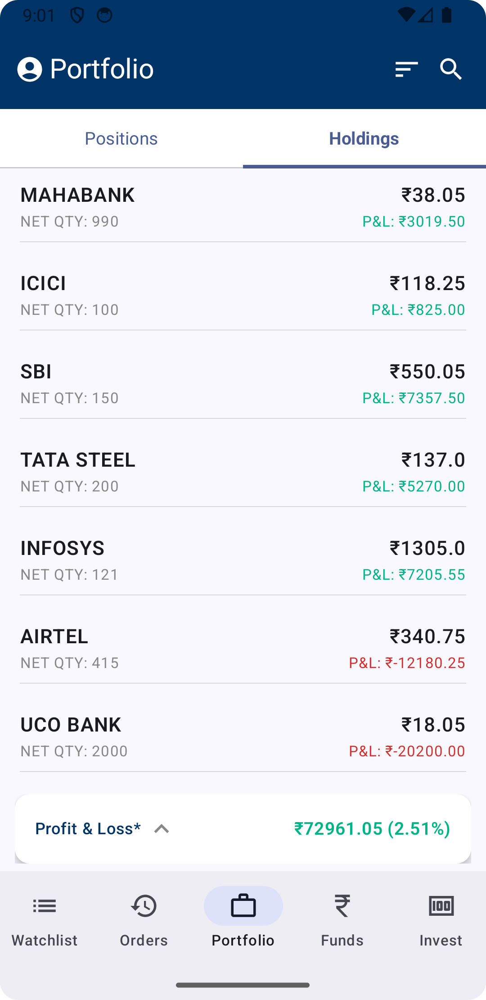
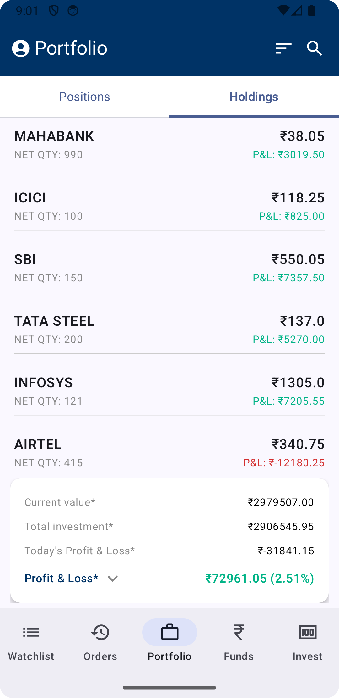

# 📱 AdhilTask – Holdings Portfolio Demo

A clean, production-ready Android demo app built with **Jetpack Compose**, **Hilt**, and **MVVM + Clean Architecture**.  
It displays a dynamic list of user stock holdings with calculated summaries and smooth expandable UI.

---

## 🧩 Features

- 🔄 Fetches holdings data from a remote API
- 📊 Calculates:
  - Current Value
  - Total Investment
  - Today's P&L
  - Total P&L
- 📌 Expandable summary card pinned at bottom
- 🎛️ Tab navigation: Positions / Holdings
- 💡 Clean UI with Material3 & Compose
- 📦 Modular architecture using:
  - MVVM
  - UseCase layer
  - Repository pattern
  - Hilt for DI

---

## 🧱 Tech Stack

| Layer          | Tools / Libraries                        |
|----------------|------------------------------------------|
| UI             | Jetpack Compose, Material 3              |
| Architecture   | MVVM + Clean Architecture                |
| DI             | Hilt                                     |
| Networking     | Retrofit + Gson                          |
| Async          | Kotlin Coroutines                        |
| Build          | Gradle + Kotlin DSL                      |
| Versioning     | Version Catalog (`libs.versions.toml`)   |

---

## 📷 Screenshots

| Home – Holdings Tab      | Expanded Summary Card    |
|--------------------------|--------------------------|
|  |  |


---

## ✅ API Reference

Mock API:
```
https://35dee773a9ec441e9f38d5fc249406ce.api.mockbin.io/
```

Response structure:
```json
{
  "data": {
    "userHolding": [
      { "symbol": "TCS", "quantity": 150, "ltp": 3500, "avgPrice": 3400, "close": 3300 }
    ]
  }
}
```

---

## 📁 Project Structure

```
com.example.amittask
├── data        // DTOs, Retrofit, RepositoryImpl
├── domain      // Domain models, Repository interface, UseCase
├── presentation
│   ├── ui      // Compose screens, viewmodel
│   └── theme   // Material3 theme setup
├── di          // Hilt modules
└── MainActivity.kt
```

---

## 🧪 TODO / Improvements

- [ ] Add unit tests for UseCase & ViewModel
- 
---